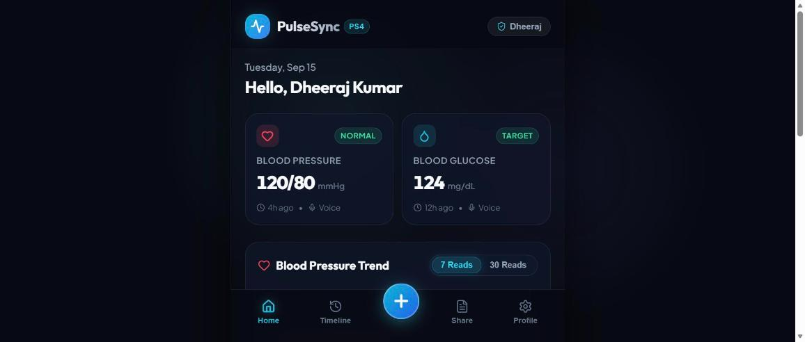
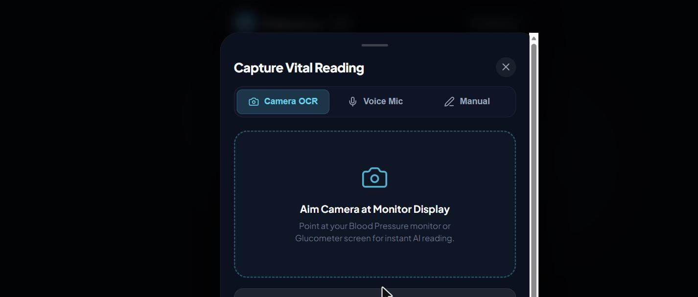
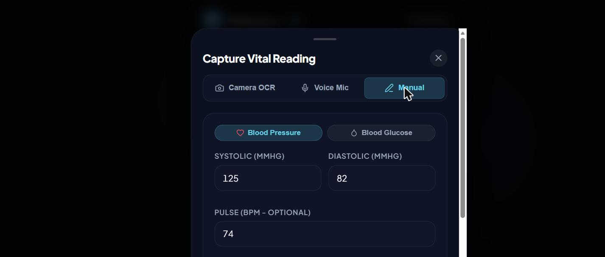
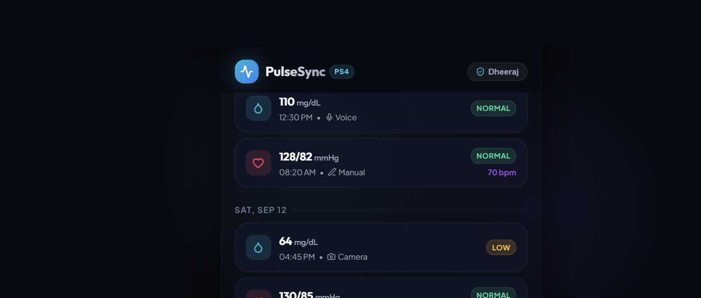
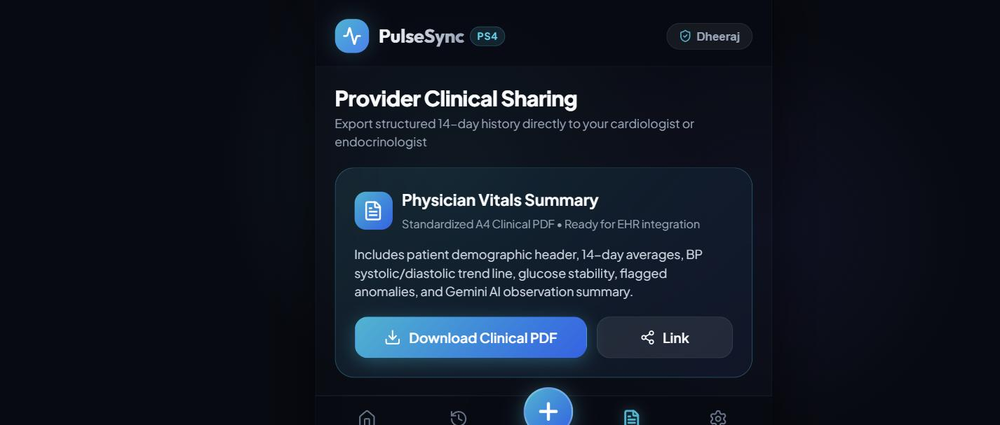
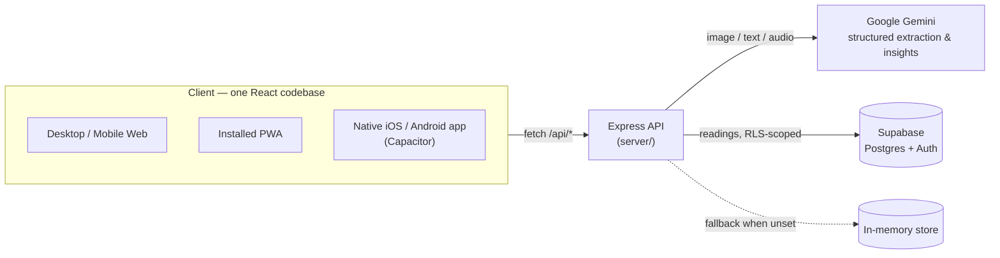

<div align="center">


# PulseSync

### One photo. One record. One shareable history — no new hardware required.

A software-only vitals platform that turns a phone camera or voice into a unified,
AI-analyzed, doctor-shareable health record — built for **Vmedithon, Problem Statement PS4**.

[](https://www.typescriptlang.org/)
[](https://react.dev/)
[](https://vitejs.dev/)
[](https://expressjs.com/)
[](https://ai.google.dev/)
[](https://supabase.com/)
[](https://capacitorjs.com/)
[](#-mobile-apps--installable-pwa)

</div>

---

## Table of Contents

- [The problem](#the-problem)
- [Screenshots](#screenshots)
- [Features](#features)
- [Tech stack](#tech-stack)
- [Architecture](#architecture)
- [Getting started](#getting-started)
- [Environment variables](#environment-variables)
- [Project structure](#project-structure)
- [Mobile apps & installable PWA](#-mobile-apps--installable-pwa)
- [Deployment](#deployment)
- [Roadmap](#roadmap)
- [License](#license)

---

## The problem

Fragmented data and lack of interoperability in health-monitoring devices — especially
for chronic conditions like hypertension and diabetes — impede effective management.
People take blood pressure and glucose readings on separate home devices, and the
numbers stay stuck on tiny screens, paper, or memory. Nobody, not the patient and not
the doctor, ever sees the trend.

**PulseSync fixes this with software only.** Point a phone camera at the monitor, the
reading is extracted automatically, and it joins one smart, trend-tracked, shareable
record — no new hardware, no manual logging.

## Screenshots

<table>
<tr>
<td align="center" width="20%"><br /><sub><b>Dashboard</b></sub></td>
<td align="center" width="20%"><br /><sub><b>Camera Capture</b></sub></td>
<td align="center" width="20%"><br /><sub><b>Manual Entry</b></sub></td>
<td align="center" width="20%"><br /><sub><b>Timeline</b></sub></td>
<td align="center" width="20%"><br /><sub><b>Provider Sharing</b></sub></td>
</tr>
</table>

## Features

| | Feature | Description |
|---|---|---|
| 📸 | **Camera capture** | Point the camera at a BP monitor or glucometer → AI extracts the numbers → you confirm before anything saves. |
| 🎙️ | **Voice input** | Speak a reading ("blood pressure 148 over 94") and it's parsed the same way as a photo. |
| 📈 | **Trend charts** | BP (systolic/diastolic) and glucose trends with clinical reference lines, 7/30-day toggle. |
| 🧠 | **AI-driven insights** | Plain-language trend summaries generated from your recent readings — never diagnostic, always with a disclaimer. |
| 🚩 | **Anomaly flagging** | Instant, rule-based high/low badges the moment a reading is saved. |
| 💊 | **Medication nudges** | A dismissible banner appears after two consecutive elevated readings. |
| 🗂️ | **Unified timeline** | Every reading, every source (camera/voice/manual), one day-grouped history. |
| 🩺 | **Provider sharing** | One-tap, doctor-ready PDF export with charts, a readings table, and the latest AI insight. |

## Tech stack

| Layer | Choices |
|---|---|
| **Frontend** | React 18, TypeScript (strict), Vite, Recharts, jsPDF + html2canvas, Web Speech API |
| **Backend** | Express, TypeScript, Zod validation, `@google/genai` (Gemini) |
| **Persistence** | Supabase (Postgres + Row Level Security) with an automatic in-memory fallback |
| **Mobile** | Capacitor (native iOS & Android shells) + a fully installable PWA — one codebase, three targets |
| **Deployment** | Render (backend, free tier) via [`render.yaml`](render.yaml) Blueprint |

## Architecture



Every Gemini call is routed through the backend — the API key never reaches the
browser or the app bundle. If no key is configured, extraction/insight endpoints
fail soft to clear placeholder responses instead of crashing, so the whole app
still runs end-to-end with zero setup.

## Getting started

**Prerequisites:** Node.js 18+

```bash
git clone https://github.com/luckynest7-beep/PulseSync-Vmedithon.git
cd PulseSync-Vmedithon
npm install

# Run the frontend + backend together
npm run dev:all
```

Open **http://localhost:5173** — the app works immediately with mock data and safe
AI fallbacks, no keys required. To enable real Gemini extraction/insights and
persistent storage, see [Environment variables](#environment-variables) below.

Other useful scripts:

```bash
npm run dev          # frontend only (offline-first)
npm run build         # production build
npm run cap:android   # build, sync, and open the native Android project
npm run cap:ios       # build, sync, and open the native iOS project (macOS only)
```

## Environment variables

**`server/.env`** (copy from `server/.env.example`):

| Variable | Required? | Purpose |
|---|---|---|
| `GEMINI_API_KEY` | Optional | Enables real AI extraction/insights. Get one free at [aistudio.google.com/apikey](https://aistudio.google.com/apikey) — no billing needed. Leave blank to run on safe stub responses. |
| `GEMINI_MODEL` | Optional | Defaults to `gemini-2.5-flash-lite`. |
| `SUPABASE_URL` / `SUPABASE_SERVICE_ROLE_KEY` | Optional | Enables persistent, RLS-scoped storage. Leave blank for an in-memory store (resets on restart). |
| `PORT` | Optional | Defaults to `8000`. |

**Frontend `.env.local`** (copy from `.env.example`):

| Variable | Required? | Purpose |
|---|---|---|
| `VITE_API_URL` | Optional | Base URL of a deployed backend. Leave blank in local dev — Vite already proxies `/api` to `localhost:8000`. |

Secrets are never committed — both `.env` files, and the mobile release keystore, are
git-ignored.

## Project structure

<details>
<summary>Expand full tree</summary>

```text
PulseSync-Vmedithon/
├── src/                        # React frontend
│   ├── components/
│   │   ├── AddReading/         # Camera / Voice / Manual capture + confirm card
│   │   ├── Dashboard/          # Charts, insight card, medication nudge banner
│   │   ├── Timeline/           # Day-grouped history + detail sheet
│   │   ├── Share/              # Doctor-facing PDF report preview
│   │   ├── Settings/, Navigation/, Common/
│   └── lib/
│       ├── api.ts              # Backend client — falls back to offline mocks on any failure
│       ├── store.ts            # Reactive state + LocalStorage persistence
│       ├── thresholds.ts       # Clinical BP/glucose flag rules
│       └── types.ts, mockData.ts, pdfExport.ts, speechParser.ts
│
├── server/                     # Express + TypeScript API
│   ├── src/routes/             # extract.ts · insight.ts · readings.ts
│   ├── src/lib/                # gemini.ts · supabase.ts · thresholds.ts
│   └── supabase/migrations/    # readings + profiles schema, RLS policies
│
├── android/, ios/               # Capacitor native projects
├── public/icons/                 # App & PWA icons
├── capacitor.config.ts, vite.config.ts (PWA plugin)
├── render.yaml                  # One-click Render Blueprint for the backend
└── MOBILE.md                    # Full native build & device-install workflow
```

</details>

## 📱 Mobile apps & installable PWA

The same React codebase ships three ways, with zero UI duplication:

- **Desktop / mobile web** — the standard Vite build, deployable anywhere static.
- **Installable PWA** — works today, no build step. "Add to Home Screen" on iOS
  Safari, or the "Install app" prompt on Android Chrome.
- **Native iOS & Android app** — wrapped with [Capacitor](https://capacitorjs.com),
  giving native camera/microphone permission dialogs and a real installable app.

Full native build, signing, and on-device install instructions live in
**[MOBILE.md](./MOBILE.md)**.

## Deployment

The backend deploys to [Render](https://render.com)'s free tier via the committed
[`render.yaml`](render.yaml) Blueprint — connect the repo, Render reads the file and
provisions the service, you just supply your `GEMINI_API_KEY`. See
[MOBILE.md](./MOBILE.md) for shipping the frontend as a signed release APK.

## Roadmap

Deliberately out of scope for now (see `plan-ps4.md` for the full hackathon spec):

- Bluetooth / vendor-API integration with real monitors
- HL7 / FHIR interoperability
- Doctor-side login portal or in-app messaging
- Custom-trained OCR/ML models (extraction is Gemini-based by design)

## License

No license has been set for this repository yet. All rights reserved to the
PulseSync team pending that decision.

---

<div align="center">
<sub>Built for Vmedithon — Problem Statement PS4 · Unified Health Monitoring Platform</sub>
</div>
